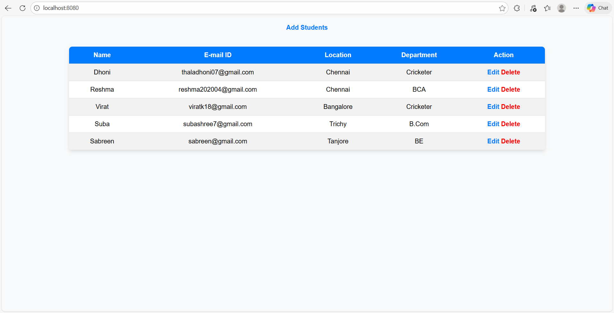
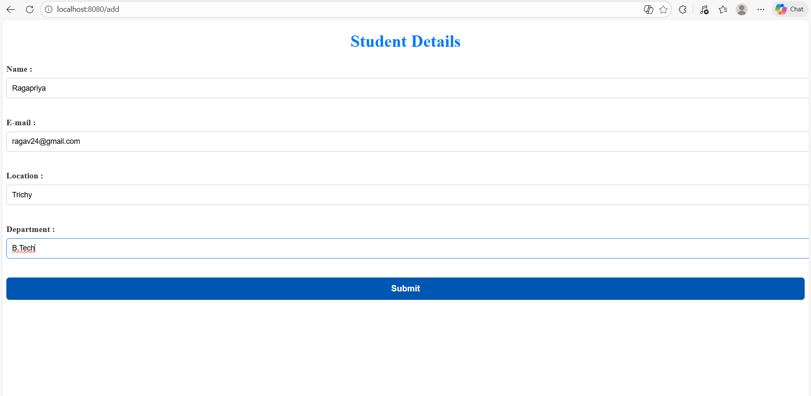
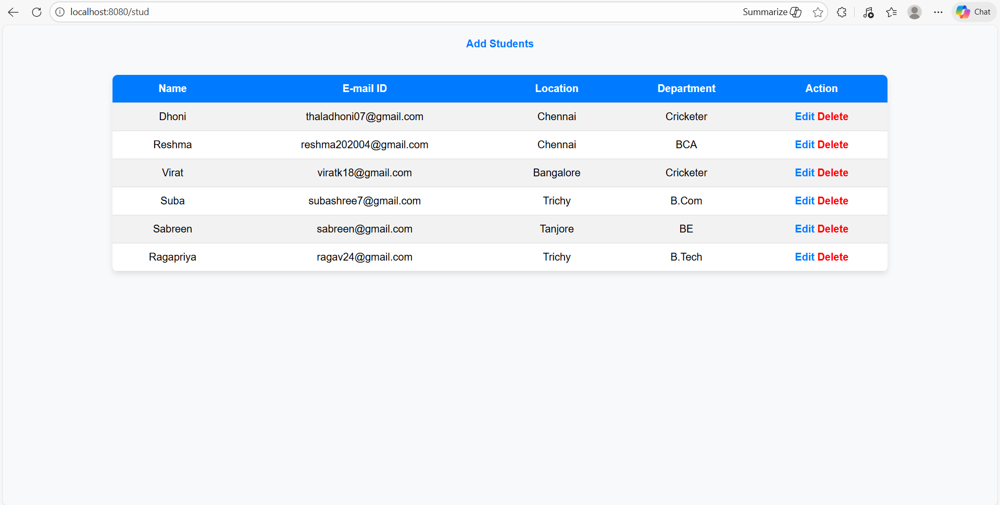
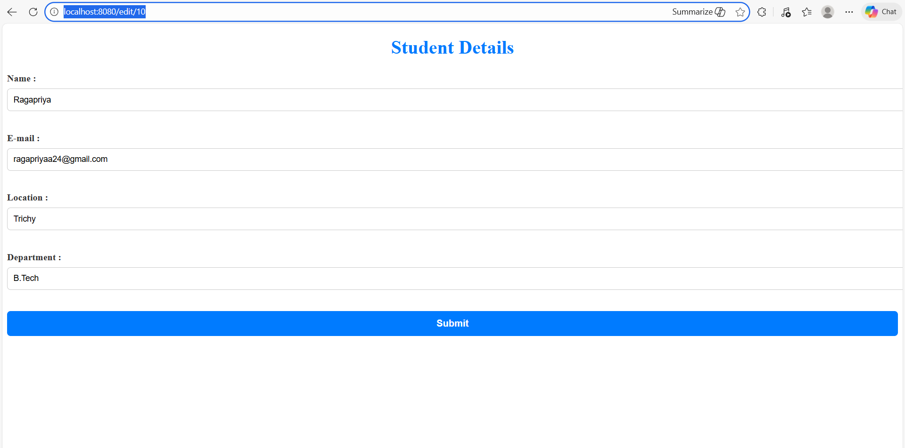
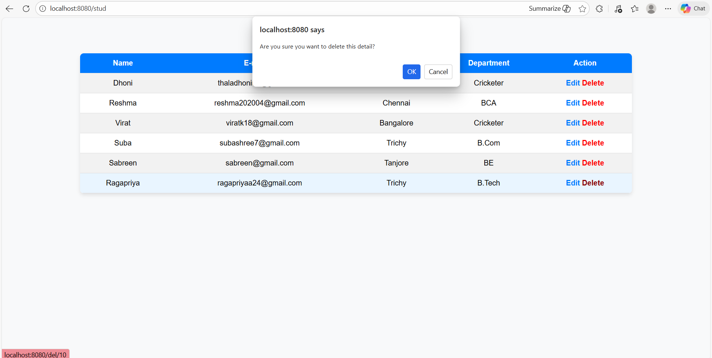

# Student Management System

A full-stack CRUD web application built using Java, Spring Boot, MySQL, and Thymeleaf.

## Features
- Add new students
- View student list
- Update student details
- Delete student records
- MVC architecture implementation
- Database integration using Spring Data JPA

## Tech Stack
- Java
- Spring Boot
- Spring Data JPA
- MySQL
- Thymeleaf
- HTML & CSS
- Maven
  
## How to Run
1. Clone the repository
2. Configure MySQL database in application.properties
3. Run the project using IntelliJ or `mvn spring-boot:run`
4. Open browser at `http://localhost:8080`

## Application Screenshots

### Student List Page

### Add Student Page

### Updated Student List

### Update Student Details Page

### Delete Student Page

---

Developed by Reshma
